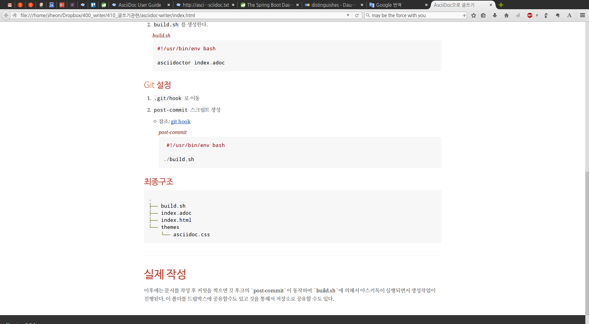
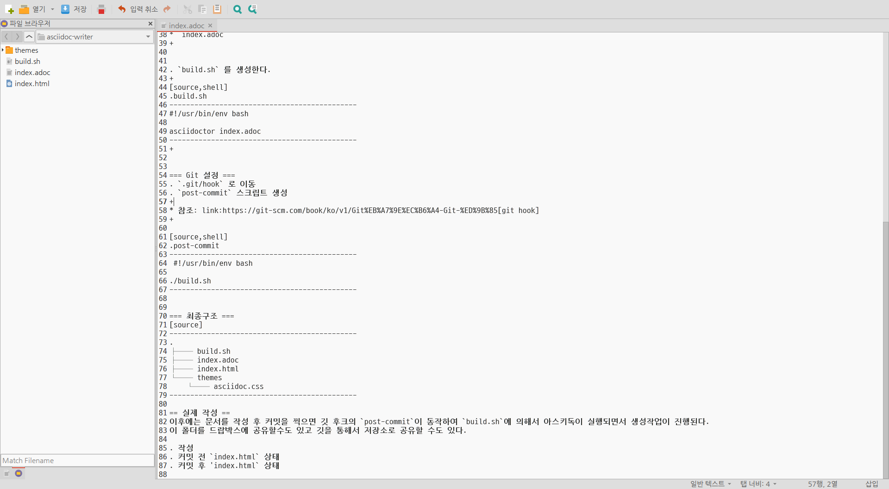
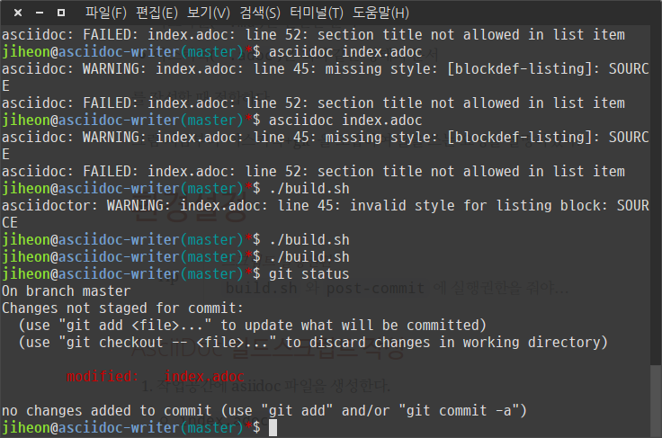

= AsciiDoc으로 글쓰기 =
김지헌, <ihoneymon@gmail.com>
v0.0.1, 24-12-2015
:Author Initials: KJH
:doctype: book
:toc:
:toclevels: 4
:icons:
:website: http://honeymon.io
:source-highlighter: prettify

최근 문서를 작성하는 과정에서 기존에는 마크다운markdown을 사용했었는데, 최근에는 아스키독(Asciidoc, link:http://asciidoc.org[])을 활용하고 있다. 

마크다운과 아스키독을 사용해보면서 내린 결론은,

* 마크다운(`*.md`)은 간단한 문서
* 아스키독(`*.adoc`)은 책과 같은 형태의 문서

를 작성할 때 적합하다.

그럼 지금부터 '아스키독+git' 을 조합하여 글을 쓰는 요령을 설명하겠다.

== 환경설정 ==

[TIP]
.스크립트 실행권환
=====================================================================
`build.sh` 와 `post-commit` 에 실행권한을 줘야...
=====================================================================

=== AsciiDoc 빌드스크립트 작성 ===
. 작업공간에 asiidoc 파일을 생성한다.
+
* `index.adoc`
+

. `build.sh` 를 생성한다.
+
[source,shell]
.build.sh
---------------------------------------------
#!/usr/bin/env bash

asciidoctor index.adoc
---------------------------------------------
+

=== Git 설정 ===
. `.git/hook` 로 이동
. `post-commit` 스크립트 생성
+
* 참조: link:https://git-scm.com/book/ko/v1/Git%EB%A7%9E%EC%B6%A4-Git-%ED%9B%85[git hook]
+

[source,shell]
.post-commit
---------------------------------------------
 #!/usr/bin/env bash

./build.sh
---------------------------------------------

=== 최종구조 ===
[source]
---------------------------------------------
.
├── build.sh
├── index.adoc
├── index.html
└── themes
    └── asciidoc.css
---------------------------------------------

== 실제 작성 ==
이후에는 문서를 작성 후 커밋을 찍으면 깃 후크의 `post-commit`이 동작하여 `build.sh`에 의해서 아스키독이 실행되면서 생성작업이 진행된다.
이 폴더를 드랍박스에 공유할수도 있고 깃을 통해서 저장소로 공유할 수도 있다.

. 작성전
+

+

. 작성
+

+

. 커밋 전 `index.html` 상태
+

+

. 커밋 후 `index.html` 상태
+
image::./images/003-after-commit.png[]
image::./images/004-after-index.png[]
+
